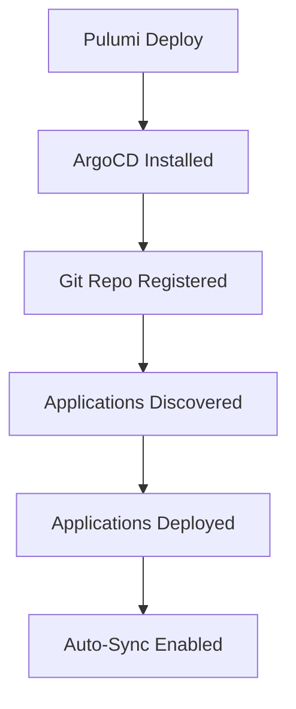

# ArgoCD GitOps Guide

## 📋 Overview

ArgoCD is automatically installed and configured in your K3s cluster, providing continuous delivery with GitOps principles. This guide explains how ArgoCD works in this setup and how to manage your applications.

**What You Get:**
- ✅ ArgoCD installed and configured
- ✅ Git repository registered
- ✅ Applications auto-deployed from Git
- ✅ Auto-sync enabled (3-minute poll interval)
- ✅ Web UI accessible via NodePort
- ✅ CLI access configured

---

## 🎯 How It Works

###

 1. **Installation Flow**

When you deploy your cluster with `argocd.enabled: true`:



### 2. **Application Discovery**

ArgoCD scans your Git repository for Application YAML files:

```
zapper-argocd/
├── apps/
│   ├── clickhouse.yaml          ← ArgoCD Application
│   ├── cloudnative-pg.yaml      ← ArgoCD Application
│   ├── peerdb-dependencies.yaml ← ArgoCD Application
│   ├── peerdb.yaml              ← ArgoCD Application
│   ├── hpa.yaml                 ← ArgoCD Application
│   └── monitoring.yaml          ← ArgoCD Application
```

Each `.yaml` file defines an ArgoCD `Application` resource that points to manifests in the same or different repository.

---

## 🚀 Accessing ArgoCD

### Web UI

```bash
# Get URL
pulumi stack output argocdUrl

# Get admin password
pulumi stack output argocdAdminPassword --show-secrets

# Open in browser
open $(pulumi stack output argocdUrl)
```

### CLI Access

1. **Install ArgoCD CLI:**

   ```bash
   # macOS
   brew install argocd

   # Linux
   curl -sSL -o /usr/local/bin/argocd https://github.com/argoproj/argo-cd/releases/latest/download/argocd-linux-amd64
   chmod +x /usr/local/bin/argocd

   # Windows
   choco install argocd-cli
   ```

2. **Login:**

   ```bash
   ARGOCD_URL=$(pulumi stack output argocdUrl | sed 's|https://||')
   ARGOCD_PASSWORD=$(pulumi stack output argocdAdminPassword --show-secrets)

   argocd login $ARGOCD_URL \
     --username admin \
     --password $ARGOCD_PASSWORD \
     --insecure
   ```

3. **Verify:**

   ```bash
   argocd app list
   ```

---

## 📦 Application Structure

### Application YAML Format

Each Application in `apps/` directory should follow this format:

```yaml
apiVersion: argoproj.io/v1alpha1
kind: Application
metadata:
  name: clickhouse
  namespace: argocd
spec:
  project: default

  # Source: Where manifests are
  source:
    repoURL: https://github.com/chalkan3/zapper-argocd
    targetRevision: main
    path: helm-values  # or manifests/clickhouse

    # If using Helm
    helm:
      valueFiles:
        - clickhouse-cluster.yaml

  # Destination: Where to deploy
  destination:
    server: https://kubernetes.default.svc
    namespace: clickhouse

  # Sync Policy: Automated sync
  syncPolicy:
    automated:
      prune: true       # Delete resources not in Git
      selfHeal: true    # Auto-fix drift
    syncOptions:
      - CreateNamespace=true  # Auto-create namespace
    retry:
      limit: 5
      backoff:
        duration: 5s
        factor: 2
        maxDuration: 3m
```

### Example Applications

#### 1. **ClickHouse Application**

```yaml
# apps/clickhouse.yaml
apiVersion: argoproj.io/v1alpha1
kind: Application
metadata:
  name: clickhouse
  namespace: argocd
  finalizers:
    - resources-finalizer.argocd.argoproj.io
spec:
  project: default
  source:
    repoURL: https://github.com/chalkan3/zapper-argocd
    targetRevision: main
    path: helm-values
    helm:
      releaseName: clickhouse
      valueFiles:
        - clickhouse-cluster.yaml
  destination:
    server: https://kubernetes.default.svc
    namespace: clickhouse
  syncPolicy:
    automated:
      prune: true
      selfHeal: true
    syncOptions:
      - CreateNamespace=true
```

#### 2. **PostgreSQL Application (CloudNativePG)**

```yaml
# apps/cloudnative-pg.yaml
apiVersion: argoproj.io/v1alpha1
kind: Application
metadata:
  name: cloudnative-pg
  namespace: argocd
spec:
  project: default
  source:
    repoURL: https://github.com/chalkan3/zapper-argocd
    targetRevision: main
    path: helm-values
    helm:
      releaseName: postgres
      valueFiles:
        - postgres-cluster.yaml
  destination:
    server: https://kubernetes.default.svc
    namespace: postgres
  syncPolicy:
    automated:
      prune: true
      selfHeal: true
    syncOptions:
      - CreateNamespace=true
```

#### 3. **PeerDB Application**

```yaml
# apps/peerdb.yaml
apiVersion: argoproj.io/v1alpha1
kind: Application
metadata:
  name: peerdb
  namespace: argocd
spec:
  project: default
  source:
    repoURL: https://github.com/chalkan3/zapper-argocd
    targetRevision: main
    path: manifests/peerdb
  destination:
    server: https://kubernetes.default.svc
    namespace: peerdb
  syncPolicy:
    automated:
      prune: true
      selfHeal: true
    syncOptions:
      - CreateNamespace=true
```

---

## 🔄 Managing Applications

### Deploy New Application

1. **Create Application YAML in Git:**

   ```bash
   cd zapper-argocd

   cat > apps/my-new-app.yaml <<EOF
   apiVersion: argoproj.io/v1alpha1
   kind: Application
   metadata:
     name: my-new-app
     namespace: argocd
   spec:
     project: default
     source:
       repoURL: https://github.com/chalkan3/zapper-argocd
       targetRevision: main
       path: manifests/my-new-app
     destination:
       server: https://kubernetes.default.svc
       namespace: my-app
     syncPolicy:
       automated:
         prune: true
         selfHeal: true
       syncOptions:
         - CreateNamespace=true
   EOF
   ```

2. **Commit and Push:**

   ```bash
   git add apps/my-new-app.yaml
   git commit -m "Add my-new-app application"
   git push
   ```

3. **ArgoCD Auto-Detects:**

   Within 3 minutes, ArgoCD will:
   - Detect the new Application file
   - Create the Application in ArgoCD
   - Sync and deploy it to the cluster

Or apply immediately:

```bash
kubectl apply -f apps/my-new-app.yaml -n argocd
```

### Update Application

1. **Update manifests in Git:**

   ```bash
   # Edit your deployment
   vim manifests/my-app/deployment.yaml

   # Commit and push
   git add manifests/my-app/deployment.yaml
   git commit -m "Update my-app image to v2.0"
   git push
   ```

2. **ArgoCD auto-syncs:**

   Within 3 minutes, changes are automatically applied.

Or sync immediately:

```bash
argocd app sync my-new-app
```

### Delete Application

1. **Remove from Git:**

   ```bash
   git rm apps/my-new-app.yaml
   git commit -m "Remove my-new-app"
   git push
   ```

2. **Or delete via CLI:**

   ```bash
   argocd app delete my-new-app
   ```

3. **Or via kubectl:**

   ```bash
   kubectl delete application my-new-app -n argocd
   ```

---

## 🎛️ Advanced Features

### Health Assessment

ArgoCD monitors application health:

```bash
# Check application health
argocd app get my-app

# Health status will be one of:
# - Healthy: All resources are healthy
# - Progressing: Resources are being deployed
# - Degraded: Some resources are unhealthy
# - Suspended: Application is suspended
# - Missing: Resources are missing
# - Unknown: Health cannot be determined
```

### Sync Windows

Restrict when apps can be synced:

```yaml
spec:
  syncPolicy:
    syncOptions:
      - RespectIgnoreDifferences=true
    syncWindow:
      schedule: "0 22 * * *"  # Only at 10 PM
      duration: 1h
      applications:
        - '*'
```

### Resource Hooks

Run jobs before/after sync:

```yaml
apiVersion: batch/v1
kind: Job
metadata:
  name: database-migration
  annotations:
    argocd.argoproj.io/hook: PreSync  # Run before sync
    argocd.argoproj.io/hook-delete-policy: HookSucceeded
spec:
  template:
    spec:
      containers:
      - name: migrate
        image: my-app:latest
        command: ["./migrate.sh"]
      restartPolicy: Never
```

Hook types:
- `PreSync` - Before sync
- `Sync` - During sync
- `PostSync` - After sync
- `SyncFail` - When sync fails
- `Skip` - Skip sync

### Ignore Differences

Ignore certain fields during sync:

```yaml
spec:
  ignoreDifferences:
  - group: apps
    kind: Deployment
    jsonPointers:
    - /spec/replicas  # Ignore replica count (for HPA)

  - group: apps
    kind: StatefulSet
    jsonPointers:
    - /spec/volumeClaimTemplates  # Ignore PVC changes
```

### Resource Tracking

Track resources with labels:

```yaml
metadata:
  labels:
    app.kubernetes.io/instance: my-app
    argocd.argoproj.io/instance: my-app
```

### Notifications

Configure Slack/Email notifications:

```yaml
apiVersion: v1
kind: ConfigMap
metadata:
  name: argocd-notifications-cm
  namespace: argocd
data:
  service.slack: |
    token: $slack-token
  template.app-deployed: |
    message: |
      Application {{.app.metadata.name}} is now running new version.
  trigger.on-deployed: |
    - send: [app-deployed]
```

---

## 🔍 Monitoring & Observability

### View Application Status

```bash
# List all applications
argocd app list

# Get detailed info
argocd app get my-app

# Get resource tree
argocd app get my-app --show-operation

# Watch sync progress
argocd app wait my-app
```

### Check Sync Status

```bash
# Via CLI
argocd app sync-status my-app

# Via kubectl
kubectl get application my-app -n argocd -o yaml

# Health and sync status
kubectl get application -n argocd
```

### View Logs

```bash
# Application logs
argocd app logs my-app

# Follow logs
argocd app logs my-app --follow

# Specific resource
argocd app logs my-app --kind Deployment --name my-deployment
```

### Metrics

ArgoCD exports Prometheus metrics:

```bash
# Access metrics endpoint
kubectl port-forward svc/argocd-metrics -n argocd 8082:8082

# View metrics
curl http://localhost:8082/metrics
```

Key metrics:
- `argocd_app_info` - Application info
- `argocd_app_sync_total` - Total syncs
- `argocd_app_k8s_request_total` - K8s API requests

---

## 🛠️ Troubleshooting

### Application Out of Sync

**Problem:** Application shows "OutOfSync"

**Solution:**

```bash
# Check differences
argocd app diff my-app

# Force sync
argocd app sync my-app --force

# Refresh without sync
argocd app get my-app --refresh
```

### Sync Failing

**Problem:** Sync operation fails

**Solutions:**

1. **Check logs:**
   ```bash
   argocd app logs my-app --kind Application
   ```

2. **Check resource events:**
   ```bash
   kubectl get events -n my-app-namespace --sort-by='.lastTimestamp'
   ```

3. **Retry with replace:**
   ```bash
   argocd app sync my-app --replace
   ```

4. **Manual intervention:**
   ```bash
   # Disable auto-sync temporarily
   argocd app set my-app --sync-policy none

   # Fix manually
   kubectl apply -f fixed-manifest.yaml

   # Re-enable auto-sync
   argocd app set my-app --sync-policy automated
   ```

### Health Check Failing

**Problem:** Application shows "Degraded"

**Solutions:**

1. **Check pod status:**
   ```bash
   kubectl get pods -n my-app-namespace
   ```

2. **Check pod logs:**
   ```bash
   kubectl logs -n my-app-namespace deployment/my-deployment
   ```

3. **Custom health check:**
   ```yaml
   # Add to argocd-cm ConfigMap
   resource.customizations: |
     apps/Deployment:
       health.lua: |
         hs = {}
         if obj.status ~= nil then
           if obj.status.conditions ~= nil then
             for i, condition in ipairs(obj.status.conditions) do
               if condition.type == "Progressing" and condition.reason == "ProgressDeadlineExceeded" then
                 hs.status = "Degraded"
                 hs.message = condition.message
                 return hs
               end
             end
           end
         end
         hs.status = "Healthy"
         return hs
   ```

### Repository Connection Issues

**Problem:** "Failed to load repository"

**Solutions:**

1. **Check repository:**
   ```bash
   argocd repo get https://github.com/chalkan3/zapper-argocd
   ```

2. **Re-add repository:**
   ```bash
   argocd repo add https://github.com/chalkan3/zapper-argocd \
     --insecure-skip-server-verification \
     --upsert
   ```

3. **For private repositories:**
   ```bash
   argocd repo add https://github.com/chalkan3/zapper-argocd \
     --username your-username \
     --password your-token
   ```

---

## 🎓 Best Practices

### 1. **Repository Structure**

Organize your repository clearly:

```
zapper-argocd/
├── apps/                    ← Application definitions
│   ├── base/                ← Base applications
│   ├── production/          ← Production overlays
│   └── staging/             ← Staging overlays
├── helm-values/             ← Helm values files
├── manifests/               ← Raw Kubernetes manifests
│   ├── app1/
│   ├── app2/
│   └── shared/
├── scripts/                 ← Helper scripts
└── README.md
```

### 2. **Use Kustomize for Overlays**

```yaml
# apps/my-app.yaml
spec:
  source:
    path: manifests/my-app/overlays/production
    kustomize:
      commonLabels:
        environment: production
```

### 3. **Environment-Specific Applications**

```yaml
# apps/production/my-app.yaml
metadata:
  name: my-app-production

# apps/staging/my-app.yaml
metadata:
  name: my-app-staging
```

### 4. **Use App Projects**

Group related applications:

```yaml
apiVersion: argoproj.io/v1alpha1
kind: AppProject
metadata:
  name: backend
  namespace: argocd
spec:
  description: Backend services
  sourceRepos:
    - https://github.com/chalkan3/zapper-argocd
  destinations:
    - namespace: 'backend-*'
      server: https://kubernetes.default.svc
  clusterResourceWhitelist:
    - group: ''
      kind: Namespace
```

Then reference in applications:

```yaml
spec:
  project: backend  # Instead of 'default'
```

### 5. **Image Updater**

Auto-update container images:

```yaml
metadata:
  annotations:
    argocd-image-updater.argoproj.io/image-list: myapp=myregistry/myapp
    argocd-image-updater.argoproj.io/myapp.update-strategy: latest
```

### 6. **Secrets Management**

**Option 1: Sealed Secrets**
```bash
# Install sealed-secrets controller
kubectl apply -f https://github.com/bitnami-labs/sealed-secrets/releases/download/v0.24.0/controller.yaml

# Seal a secret
kubeseal --format yaml < secret.yaml > sealed-secret.yaml

# Commit sealed-secret.yaml to Git
```

**Option 2: External Secrets Operator**
```yaml
apiVersion: external-secrets.io/v1beta1
kind: ExternalSecret
metadata:
  name: my-secret
spec:
  secretStoreRef:
    name: vault-backend
  target:
    name: my-app-secret
  data:
    - secretKey: password
      remoteRef:
        key: secret/data/my-app
        property: password
```

### 7. **Resource Limits**

Always set resource limits:

```yaml
resources:
  limits:
    cpu: 1000m
    memory: 1Gi
  requests:
    cpu: 100m
    memory: 128Mi
```

---

## 📚 Additional Resources

- **ArgoCD Documentation:** https://argo-cd.readthedocs.io/
- **Best Practices:** https://argo-cd.readthedocs.io/en/stable/user-guide/best_practices/
- **Examples:** https://github.com/argoproj/argocd-example-apps

---

## ✅ Checklist

Before going to production:

- [ ] All applications deployed successfully
- [ ] Health checks passing
- [ ] Auto-sync enabled and working
- [ ] Secrets properly managed (Sealed Secrets/External Secrets)
- [ ] Resource limits set on all deployments
- [ ] Monitoring and alerts configured
- [ ] Backup strategy in place
- [ ] Disaster recovery plan documented
- [ ] Team trained on ArgoCD operations
- [ ] GitOps workflows documented

---

← [Getting Started](./GETTING_STARTED.md) | Next: [Configuration Reference](./CONFIGURATION.md) →
